# Diagrama de Classes - Gym Hub

```mermaid
classDiagram
    direction LR

    class Aluno {
        -Long id
        -String nome
        -Double altura
        -Double massaCorporal
        -Date nascimento
        -String user
        -String senha
        -LocalDateTime dataCadastro
        -double imc
        -String cpf
        +calcularEAtualizarImc() void
    }

    class Professor {
        -long id
        -String nome
        -String cref
        -String especialidade
        -String sobre
        -double avaliacao
        -String cpf
    }

    class Aula {
        -long id
        -String nome
        -String descricao
        -String duracao
    }

    class Exercicio {
        -Long id
        -String nome
        -String descricao
        -String videoURL
        -int series
        -int repeticoes
        -String musculoAlvo
    }

    class Equipamento {
        -long id
        -String nome
        -String descricao
        -String anatomia
    }

    class IAlunoService {
        <<interface>>
        +create(AlunoRequest) AlunoResponse
        +listAll() List~AlunoResponse~
        +findById(long) AlunoResponse
        +update(long, AlunoRequest) AlunoResponse
        +delete(long) void
    }

    class IProfessorService {
        <<interface>>
        +create(ProfessorRequest) ProfessorResponse
        +listAll() List~ProfessorResponse~
        +findById(long) ProfessorResponse
        +update(long, ProfessorRequest) ProfessorResponse
        +delete(long) void
    }

    class IAulaService {
        <<interface>>
        +create(AulaRequest) AulaResponse
        +listAll() List~AulaResponse~
        +findById(long) AulaResponse
        +update(long, AulaRequest) AulaResponse
        +delete(long) void
    }

    class IExercicioService {
        <<interface>>
        +create(ExercicioRequest) ExercicioResponse
        +listAll() List~ExercicioResponse~
        +findById(long) ExercicioResponse
        +update(long, ExercicioRequest) ExercicioResponse
        +delete(long) void
    }

    class IEquipamentoService {
        <<interface>>
        +create(EquipamentoRequest) EquipamentoResponse
        +listAll() List~EquipamentoResponse~
        +findById(long) EquipamentoResponse
        +update(long, EquipamentoRequest) EquipamentoResponse
        +delete(long) void
    }

    class AlunoService
    class ProfessorService
    class AulaService
    class ExercicioService
    class EquipamentoService

    class AlunoController
    class ProfessorController
    class AulaController
    class ExercicioController
    class EquipamentoController

    class IAlunoMapper {
        <<interface>>
        +paraEntidade(AlunoRequest) Aluno
        +paraDTO(Aluno) AlunoResponse
    }

    class IProfessorMapper {
        <<interface>>
        +paraEntidade(ProfessorRequest) Professor
        +paraDTO(Professor) ProfessorResponse
    }

    class IAulaMapper {
        <<interface>>
        +paraEntidade(AulaRequest) Aula
        +paraDTO(Aula) AulaResponse
    }

    class IExercicioMapper {
        <<interface>>
        +paraEntidade(ExercicioRequest) Exercicio
        +paraDTO(Exercicio) ExercicioResponse
    }

    class IEquipamentoMapper {
        <<interface>>
        +paraEntidade(EquipamentoRequest) Equipamento
        +paraDTO(Equipamento) EquipamentoResponse
    }

    class AlunoMapper
    class ProfessorMapper
    class AulaMapper
    class ExercicioMapper
    class EquipamentoMapper

    class AlunoRepository {
        <<interface>>
    }

    class ProfessorRepository {
        <<interface>>
    }

    class AulaRepository {
        <<interface>>
    }

    class ExercicioRepository {
        <<interface>>
    }

    class EquipamentoRepository {
        <<interface>>
    }

    class JpaRepository {
        <<interface>>
    }

    AlunoService ..|> IAlunoService
    ProfessorService ..|> IProfessorService
    AulaService ..|> IAulaService
    ExercicioService ..|> IExercicioService
    EquipamentoService ..|> IEquipamentoService

    AlunoMapper ..|> IAlunoMapper
    ProfessorMapper ..|> IProfessorMapper
    AulaMapper ..|> IAulaMapper
    ExercicioMapper ..|> IExercicioMapper
    EquipamentoMapper ..|> IEquipamentoMapper

    AlunoRepository --|> JpaRepository
    ProfessorRepository --|> JpaRepository
    AulaRepository --|> JpaRepository
    ExercicioRepository --|> JpaRepository
    EquipamentoRepository --|> JpaRepository

    AlunoController --> IAlunoService
    ProfessorController --> IProfessorService
    AulaController --> IAulaService
    ExercicioController --> IExercicioService
    EquipamentoController --> IEquipamentoService

    AlunoService --> AlunoRepository
    ProfessorService --> ProfessorRepository
    AulaService --> AulaRepository
    ExercicioService --> ExercicioRepository
    EquipamentoService --> EquipamentoRepository

    AlunoService --> IAlunoMapper
    ProfessorService --> IProfessorMapper
    AulaService --> IAulaMapper
    ExercicioService --> IExercicioMapper
    EquipamentoService --> IEquipamentoMapper

    AlunoRepository --> Aluno
    ProfessorRepository --> Professor
    AulaRepository --> Aula
    ExercicioRepository --> Exercicio
    EquipamentoRepository --> Equipamento
```

## Observacao

No codigo atual, as entidades `Aluno`, `Professor`, `Aula`, `Exercicio` e `Equipamento` nao possuem relacionamentos JPA entre si, como `@OneToMany`, `@ManyToOne` ou `@ManyToMany`. Por isso, o diagrama representa principalmente a estrutura em camadas do projeto: controllers dependem de services, services usam repositories e mappers, e repositories persistem as entidades.
